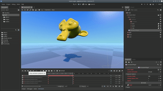
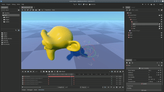
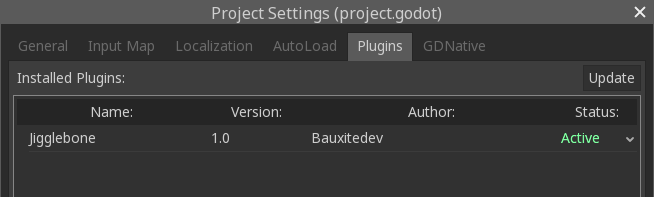
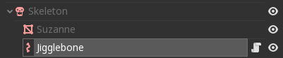
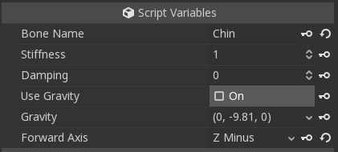
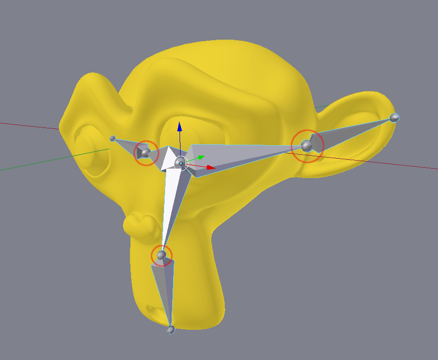
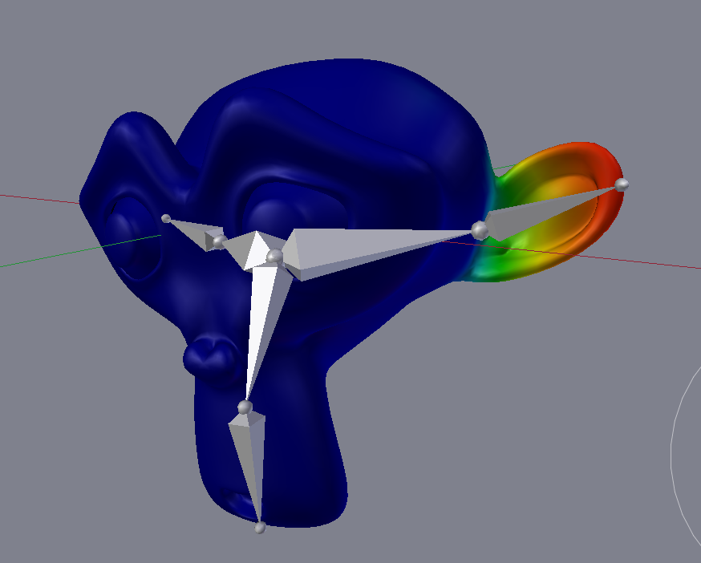

# Godot Jigglebones

This is an addon that adds jigglebones to Godot 3.0. If you don't know what that is: jigglebones are bones that jiggle when the skeleton moves. They are used for procedural animation, so you can move only the important parts of the skeleton and the little bits will automatically jiggle with it.

You can also drag the jigglebones in the editor and fiddle around with them:

It can be used for:

- Hair
- Floppy ears/noses
- Feathers
- Tails
- Fish fins
- Chains/belts/ropes/amulets
- Balloons
- Ragdolls (sort of)
- Sacks of flesh/fat rolls
- And anything else you can think of!

[Here's a video of it in action!](https://youtu.be/hJtRCyUwJLY)

# How to use it 

1. Download the repository as zip and extract it.
2. Copy the `addons` folder into the root folder of your project, writing into it if it already exists.
3. Now re-open your project, then in the menu bar go to Project → Project Settings, then go to the Plugins tabs, and then set the Jigglebone addon to activated. It should look like this:

    

4. In the scene of your game, find the Skeleton node of your character and select it. (If you don't have a rigged skeleton yet, skip to section Rigging, then come back here.) Click the plus icon above the scene tree to add a node, then select Jigglebone.
5. Now your scene should look like this, with the Jigglebone being a direct child of the Skeleton:

    

6. With the jigglebone selected, go to the inspector and set the `Bone name` property to the name of the bone you want to turn into a jigglebone. E.g. if you have a bone named "Chin", then it would look like this:

    
    
7. That's all! Enjoy your jiggling! If you want more jigglebones, just repeat step 4-6 again and enter another bone name.

8. Optionally, for further control, you can tune the parameters, see below.

# Parameters

**Stiffness**: Controls how stiff the jigglebone is. Use a very low value like 0.1 for very sluggish moving and large bones like tails, or a high value like 10 for high tension rubber or elastic material.

**Damping**: Controls how fast the bone returns to it rest state. A low value like 0 will cause the bone to oscillate for a long time. A high value like 10 can be used to simulate things like fish fins, which will stop moving quickly after jiggling once.

**Use Gravity**: If checked, this will cause the jigglebone to obey gravity and drop to the floor. Use it for e.g. droopy ears, ropes, or anything else that sags down.

**Gravity**: With this control you can select a custom gravity direction. E.g. if you want to have something that sags up instead of down, like a balloon, you can set the gravity to (0, 9.81, 0) to flip gravity around. Or, you can add some X and Z movement to simulate wind.

**Forward Axis**: By default, the -Z axis is used as the forward direction of the bone, which works well with models exported from Blender. However, if you use another 3D modelling tool, the bone might be pointing into the wrong direction. In that case you can try some other axes here to see which is the right one.

# Rigging

This section explains how to setup your jigglebones in your modelling tool. I'm going to use Blender here but the process should work in other 3d modelling tools as well.

Basically, jigglebones are setup just like any other bone (I assume you know how to do this). Just be sure to give the bone a memorable name, which should be the same name you'll set in the `Bone name` property in the inspector. The project comes with an example, the well-known Suzanne, which I rigged to have floppy ears and a droopy chin. The rig looks like this:

There are three guidelines to keep in mind:

1. The base of the bone is the pivot point around which the jigglebone will rotate. In the image they are circled with a red outline.
2. A jigglebone should be at the end of the bone hierarchy. That means, ideally, a jigglebone should not have any child bones. This is not a strict rule, but the chance of things breaking increases when you do this. Additionally, having a jigglebone be a child of another jigglebone will very likely break everything horribly. The same will probably happen when you have an animated bone that is a child of a jigglebone.
3. A jigglebone should not be animated. The parent bones can have animation, but the jigglebone itself shouldn't. The reason for this is that the bone motion will override the jigglebone motion, which will kill the effect of the jigglebone.

After this just paint your weights as usual. E.g. for the left ear, the weights on Suzanne look like this:

Note that every vertex that is on the left side of the pivot point has a weight of zero - this prevents the head jiggling when the ear jiggles. But, depending on your application, that can actually be a desirable effect. Just play around with it!

Finally, you just export your model to .dae or .gltf so Godot can import it. Then go to the section "How to use it" to setup the jigglebone in your game.

If you're still in doubt, I have included the `.blend` file in the `models` folder so you can check out the rig yourself.

# Limitations/Known Issues

- Occasionally the bone gets into a twisted state. You can grab the jigglebone in the editor and carefully move it back in a twisting motion to fix it (use the move handles - rotation won't affect it). 
- The jiggling is stronger in the editor compared to ingame. I'll look into this.

# License
MIT
