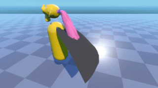
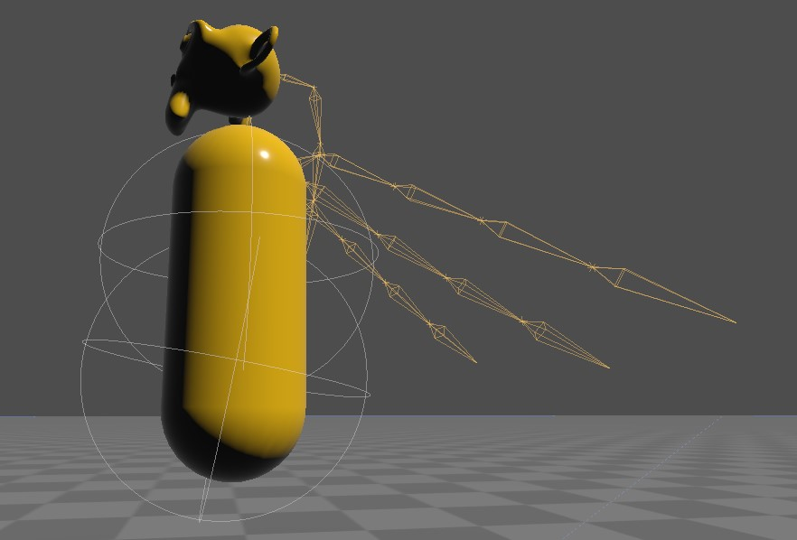

# Godot Jigglebones

This is an addon that adds jigglebones to Godot 3.x. Jigglebones are bones that jiggle when the skeleton moves. They are used for procedural animation, so you can move only the important parts of the skeleton and the little bits will automatically jiggle with it.

It can be used for:

- Hair
- Capes and other clothing items
- Floppy ears/noses
- Feathers
- Tails
- Fish fins
- Chains/belts/ropes/amulets
- Balloons
- Ragdolls (sort of)
- Breasts
- Sacks of flesh/fat rolls
- And anything else you can think of!

[Here's a video of it in action!](https://youtu.be/hJtRCyUwJLY)

# How to use it 

1. Download the repository as zip and extract it.
2. Copy the `addons` folder into the root folder of your project, writing into it if it already exists.
3. Now re-open your project, then in the menu bar go to Project → Project Settings, then go to the Plugins tabs, and then set the Jigglebone addon to activated. It should look like this:

    

4. In the scene of your game, find the Skeleton node of your character and select it. (If you don't have a rigged skeleton yet, skip to section Rigging, then come back here.) Click the plus icon above the scene tree to add a node, then select Jigglebone.
5. Now your scene should look like this, with the Jigglebone being a direct child of the Skeleton:

    

6. With the jigglebone selected, go to the inspector and set the `Bone name` property to the name of the bone you want to turn into a jigglebone. E.g. if you have a bone named "Chin", then it would look like this:

    

7. That's all! Enjoy your jiggling! If you want more jigglebones, just repeat step 4-6 again and enter another bone name.

8. Optionally, for further control, you can tune the parameters, see below.

# Parameters

**Enabled**: Enables or disables processing of this node during runtime.

**Stiffness**: Controls how stiff the jigglebone is. Use a very low value like 0.1 for very sluggish moving and large bones like tails, or a high value like 10 for high tension rubber or elastic material.

**Damping**: Controls how fast the bone returns to it rest state. A low value like 0 will cause the bone to oscillate for a long time. A high value like 10 can be used to simulate things like fish fins, which will stop moving quickly after jiggling once.

**Use Gravity**: If checked, this will cause the jigglebone to obey gravity and drop to the floor. Use it for e.g. droopy ears, ropes, or anything else that sags down.

**Gravity**: With this control you can select a custom gravity direction. E.g. if you want to have something that sags up instead of down, like a balloon, you can set the gravity to (0, 9.81, 0) to flip gravity around. Or, you can add some X and Z movement to simulate wind.

**Forward Axis**: By default, the -Z axis is used as the forward direction of the bone, which works well with models exported from Blender. However, if you use another 3D modelling tool, the bone might be pointing into the wrong direction. In that case you can try some other axes here to see which is the right one.

**Collision Shape**: Optionally, select the desired `CollisionShape` node, which can be anywhere in your scene tree. The only supported shape is `SphereShape`. See below for more details.

# Collision

If you wish to use collision, create a `CollisionShape`, and within it, add a `SphereShape`. Set your desired location and radius.

The `CollisionShape` can be placed anywhere in your tree, and can be one that is used for other purposes as well, as long as it is a `SphereShape`. If it is used exclusively for JiggleBones, make sure to disable the `CollisionShape`.

JiggleBones does not use the physics system. Instead it calculates its own physics. This `CollisionShape` is used only as a visual indicator to communicate where you want the JiggleBone to collide. Disabling it prevents the physics system from processing it. You may ignore the warning that will appear on the `CollisionShape` about needing a `PhysicsBody`.

If you have an object with multiple JiggleBones, say a ponytail with 3 bones, you may set them all to the same `CollisionShape`.

In the example below, the cape has 13 bones split up into 3 chains of 4 bones down the left, right and middle, plus a root bone. Only the top 3 of each chain are using JiggleBones, so 9 in total. The ponytail has 4 bones, but only the bottom 3 are using JiggleBones. 

There are two `CollisionShapes`. The upper one keeps the ponytail off the back and cape. The lower one keeps the body from poking through the cape.

This scene runs at 600-750fps @ 1920x1080 on a GTX 1060.

Here the skeletons for the cape, ponytail, and the two collision spheres are visible.

# Rigging

This section explains how to setup your jigglebones in your modelling tool. I'm going to use Blender here but the process should work in other 3d modelling tools as well.

Basically, jigglebones are setup just like any other bone (I assume you know how to do this). Just be sure to give the bone a memorable name, which should be the same name you'll set in the `Bone name` property in the inspector. The project comes with an example, the well-known Suzanne, which I rigged to have floppy ears and a droopy chin. The rig looks like this:

There are some guidelines to keep in mind:

1. The base of the bone is the pivot point around which the jigglebone will rotate. In the image they are circled with a red outline.
2. A jigglebone should not be animated. The parent bones can have animation, but the jigglebone itself shouldn't. The reason for this is that the bone motion will override the jigglebone motion, which will kill the effect of the jigglebone.

After this just paint your weights as usual. E.g. for the left ear, the weights on Suzanne look like this:

Note that every vertex that is on the left side of the pivot point has a weight of zero - this prevents the head jiggling when the ear jiggles. But, depending on your application, that can actually be a desirable effect. Just play around with it!

Finally, you just export your model to .dae or .gltf so Godot can import it. Then go to the section "How to use it" to setup the jigglebone in your game.

If you're still in doubt, I have included the `.blend` file in the `models` folder so you can check out the rig yourself.

# How Does JiggleBones Compare To SoftBody And RagDoll Physics?

JiggleBones does not use the physics system in Godot. It calculates its own physics.

Both SoftBody and RagDoll are methods of physics simulation that can be used to simulate dynamically moving hair, body parts, and clothes. However, in my experience (@tinmanjuggernaut), these physics simulations introduce a lot of stretching and breaking of meshes. The parameters are often too subtle and ineffective at providing control over how the simulation runs.

JiggleBones is far superior to either because it does not stretch the mesh outside of normal bending allowed by the bones and weight painting, and the parameters provide great control. The missing piece was collision, and that has now been added.

# Limitations/Known Issues

No known issues outstanding. See below.

# Changes From The Original Version

This repository is a forked version by Cory Petkovsek (@tinmanjuggernaut), which includes the following changes:

* Compatibility updated for 3.2 and beyond (by yaelatletl and others)
* Add collision support
* Static typing
* Disabled tool mode (JiggleBones runs only at runtime)
* Option to Enable/Disable a JiggleBone node
* Move verification to the start, to reduce code ran in each frame
* Change to `_physics_process()` for a more consistent simulation

# License

MIT
